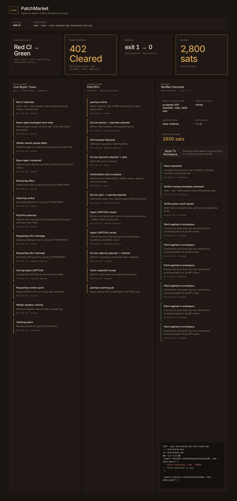

# PatchMarket

> **Pay for verified outcomes, not tokens.**
> An open protocol where one AI agent hires another to fix a bug — and money only moves when the test goes green.

`HackNation 2026 · Spiral track · Earn in the Agent Economy`

> 🎬 **[Demo video](docs/videos/demo.mp4)** — 60-second UI/UX walkthrough
> 🛠️ **[Tech video](docs/videos/tech.mp4)** — 90-second architecture explainer



---

## What this is

Three real things working together over one open protocol:

- **A buyer agent** that detects red CI, scores worker offers by expected cost to green, pays through a real `402 Payment Required` gate, and verifies the outcome before releasing escrow.
- **A worker agent** that runs as a separate process, claims the job after solving an agent-only CAPTCHA, and writes a real unified diff inside an isolated sandbox.
- **A neutral verifier** that copies the fixture into a fresh temp worktree, applies the patch, reruns the pinned acceptance command, and signs the proof over seven hashes. The worker only earns sats if the test goes from `exit 1` to `exit 0`.

Everything you see is the actual implementation. The L402 gate, the agent CAPTCHA, the verifier subprocess, and the file changing in your repo via Apply-to-Workspace are all real. Only the Lightning settlement is simulated for stage reliability — the protocol mechanic around it is not.

---

## Quickstart

```sh
# clone, then:
npm run showtime
```

Then open **http://localhost:3000/?demo=1** in your browser. F11 for full-screen.

The spectator UI auto-fires the live OpenAI buyer. The worker daemon polls in the background. Use **→** or **Space** to advance scenes, **←** to replay, **Esc** to dismiss.

For the live cross-vendor flow (OpenAI buyer ↔ Anthropic Claude Code worker), set both:

```sh
export OPENAI_API_KEY=sk-...   # or put it in .env
claude /login                  # if not already authed
PATCHMARKET_WORKER_ENGINE=claude-code npm run showtime
```

---

## Architecture

```
                   ┌──────────────────────────┐
                   │      PatchMarket         │
                   │   server (HTTP + FSM)    │
   ┌───────────┐   │                          │   ┌─────────────────┐
   │   Buyer   ├──►│  /v1/jobs/fix            │◄──┤  Worker daemon  │
   │  agent    │   │  /v1/jobs/:id/select     │   │   (separate     │
   │           │   │  /v1/jobs/:id/claim ─402 │   │     PID)        │
   │ OpenAI    │◄──┤  /v1/jobs/:id/captcha    ├──►│                 │
   │ tool calls│   │  /v1/jobs/:id/patch      │   │ spawns claude   │
   └───────────┘   │  /v1/jobs/:id/verify     │   │ --print as a    │
                   │  /v1/jobs/:id/apply      │   │ subprocess      │
                   │                          │   └─────────────────┘
                   │      escrow FSM          │
                   │  16 states, signed       │
                   │  transitions, simulated  │
                   │  L402 settlement         │
                   └─────────────┬────────────┘
                                 │  spawn(node --test) in
                                 ▼  /tmp/patchmarket-verify-*
                   ┌──────────────────────────┐
                   │     Verifier subprocess  │
                   │                          │
                   │ • copies fixture clean   │
                   │ • applies patch          │
                   │ • reruns pinned test     │
                   │ • signs proof over       │
                   │   seven hashes           │
                   └──────────────────────────┘
```

Three real PIDs at runtime, plus the verifier as an ephemeral subprocess. Buyer and worker never touch each other directly — every interaction goes through the server's HTTP API and the escrow finite state machine.

---

## The protocol, end to end

1. Buyer agent detects red CI in `fixtures/red-ci`.
2. PatchMarket scores worker offers by `expected_cost_to_green = price / pass_rate` plus latency and trust penalties.
3. Buyer explicitly selects a worker via `POST /v1/jobs/:id/select`.
4. Buyer requests claim: `POST /v1/jobs/:id/claim` returns **`402 Payment Required`** with `WWW-Authenticate: L402 invoiceHash="…", amountSats="…"`.
5. Buyer retries with `Authorization: L402 proof=…, nonce=…, invoiceHash=…`.
6. Server issues an **agent-only CAPTCHA**: 32 random bytes, a 3-step byte program, HMAC-bound to a server nonce, 30-second TTL.
7. Worker solves the CAPTCHA → server issues a short-lived signed claim credential.
8. Worker submits a patch scoped to `src/auth.mjs` (tests, scripts, lockfiles are off-limits — enforced by `validatePatch`).
9. **Verifier** spawns Node, runs `node --test --test-reporter=tap tests/auth.test.mjs` in a fresh temp worktree, applies the patch, reruns the same command. If exit-code flips from `1` to `0`, the proof is signed over the hash chain.
10. Escrow releases. Worker reputation updates.
11. (Optional) `POST /v1/jobs/:id/apply` writes the verified patch back into `fixtures/red-ci/src/auth.mjs` so VS Code's git gutter lights up the diff.

---

## Live worker engine

By default the worker submits a deterministic patch baked into the demo. With `--engine=claude-code` it spawns a real Claude Code subprocess that generates the diff itself:

```sh
node bin/patchmarket-worker.mjs --engine claude-code
```

The subprocess gets a strict system prompt (PatchPro persona, output-only-diff requirement) plus the failing test and source as user content. Output is normalized through `src/patch-normalizer.mjs` (strips fences, validates `diff --git` header, rewrites `./`-prefixed paths, runs the existing path validator). Up to 3 attempts; on exhaustion, the worker emits a `worker.engine_fallback` event and falls back to the deterministic patch. The demo never breaks — the failure path is just invisible to the audience.

`npm run smoke:full` exercises the full live path: OpenAI buyer + Claude Code worker + real verifier subprocess. Skips gracefully if either credential is missing.

---

## Fixture

Intentionally broken — accepts expired tokens for a 30-second grace window:

```sh
cd fixtures/red-ci
node --test --test-reporter=tap tests/auth.test.mjs
```

The submitted patch changes only `src/auth.mjs`:

```diff
-  return expiresAt < now - 30000;
+  return expiresAt <= now;
```

Tests, scripts, lockfiles, and CI config are all off-limits — `validatePatch` rejects diffs that touch them.

---

## API

```txt
POST /v1/jobs/reset
GET  /v1/jobs/current
POST /v1/jobs/fix
GET  /v1/jobs/:id/offers
POST /v1/jobs/:id/select
POST /v1/jobs/:id/claim       # returns 402 without Authorization
POST /v1/jobs/:id/claim       # accepts Authorization: L402 proof=..., returns agent CAPTCHA
POST /v1/jobs/:id/captcha     # accepts CAPTCHA answer + HMAC, returns claim credential
POST /v1/jobs/:id/patch       # worker submits patch (deterministic or live)
POST /v1/jobs/:id/verify      # spawns verifier, returns signed VerificationProof
POST /v1/jobs/:id/apply       # writes verified patch to workspace
POST /v1/jobs/:id/buyer-events
POST /v1/jobs/:id/worker-events
GET  /v1/jobs/:id
GET  /v1/jobs/:id/events?cursor=N
POST /v1/demo/run             # spectator-mode auto-run trigger
GET  /v1/demo/run-state
```

---

## Tests and smokes

```sh
npm test              # 14 unit tests, all green
npm run smoke         # deterministic end-to-end, in-process server
npm run smoke:live    # buyer in OpenAI mode, worker deterministic; skips without OPENAI_API_KEY
npm run smoke:full    # both sides live; skips without OPENAI_API_KEY or claude CLI
```

`smoke:full` asserts `buyer.mode === "openai"`, `worker.engine === "claude-code"`, `worker.source === "live-engine"`, no fallback fired, and `released` final state with `exit 1 → 0`.

---

## Skeptic Q&A

**"Did the verifier actually run the test?"**
Yes. It copies `fixtures/red-ci` into a unique `/tmp/patchmarket-verify-*` directory, runs `node --test --test-reporter=tap tests/auth.test.mjs` as a real subprocess, applies the submitted patch, and reruns the same command. The exit codes you see (`1` then `0`) come from POSIX, not from a string the protocol made up.

**"Is the L402 real?"**
The protocol mechanic is real — protected endpoints really return `402 Payment Required` with `WWW-Authenticate: L402`, and the buyer must retry with a matching `Authorization: L402` proof bound to nonce + invoice hash + amount. The settlement layer is simulated for stage reliability; production would plug an LND or LDK preimage in behind the same proof boundary without changing the agent flow.

**"What does the agent CAPTCHA prove?"**
Only that the claimant can read a challenge, execute byte-transform code, and respond inside 30 seconds. It's a claim gate (single-use, time-bounded, replay-proof, nonce-bound) — not a humanness or honesty proof. Inspired by Dhravya Shah's [`agent-captcha`](https://github.com/Dhravya/agent-captcha); reimplemented with a fixed transform program plus random data per challenge.

**"Why not just use API billing?"**
API billing pays for tokens regardless of whether the agent produces a working result. PatchMarket pays only when the verifier signs a passing test. The release rule is the whole product.

**"What stops a worker cheating the verifier?"**
The acceptance command is hashed and signed into the proof at job creation time — `commandHash` is bound. The verifier runs from a clean fixture every time. The patch path is restricted to allowed files. Tests, package scripts, CI config, and lockfiles are explicitly forbidden by `validatePatch`. The proof signs hashes of the before-log and after-log too, so the worker can't doctor logs.

---

## Source map

```
src/buyer.mjs                  OpenAI Responses API tool-calling buyer
src/server.mjs                 HTTP + escrow FSM + L402 + CAPTCHA
src/core.mjs                   FSM, validatePatch, signed proofs, demo data
src/verifier.mjs               temp-worktree subprocess sandbox
src/live-worker-engine.mjs     spawnCli wrapper for claude/codex/opencode
src/patch-normalizer.mjs       strict diff cleanup + validation gate
bin/patchmarket-worker.mjs     polling worker daemon
bin/patchmarket-buyer.mjs      buyer CLI (auto/openai/scripted modes)
bin/patchmarket.mjs            server CLI
scripts/showtime.mjs           one-command orchestrator
public/app.js                  spectator + 9 cinematic scenes
public/scene-stage.css         Vercel-grade scene styling
public/architecture.html       7-slide architecture deck (?architecture)
test/*.test.mjs                14 unit tests
docs/VIDEO_SCRIPTS.md          locked submission video scripts
```

About 5,000 lines of Node total. Zero runtime dependencies in the protocol path. Any agent framework on the buyer side, any agent on the worker side — they just have to speak the protocol.

---

## Built at HackNation 2026

Built for the Spiral track ("Earn in the Agent Economy"). The Agent CAPTCHA design borrows from Dhravya Shah's open-source [`agent-captcha`](https://github.com/Dhravya/agent-captcha) — implementation is original, the inverse-CAPTCHA concept is theirs.
